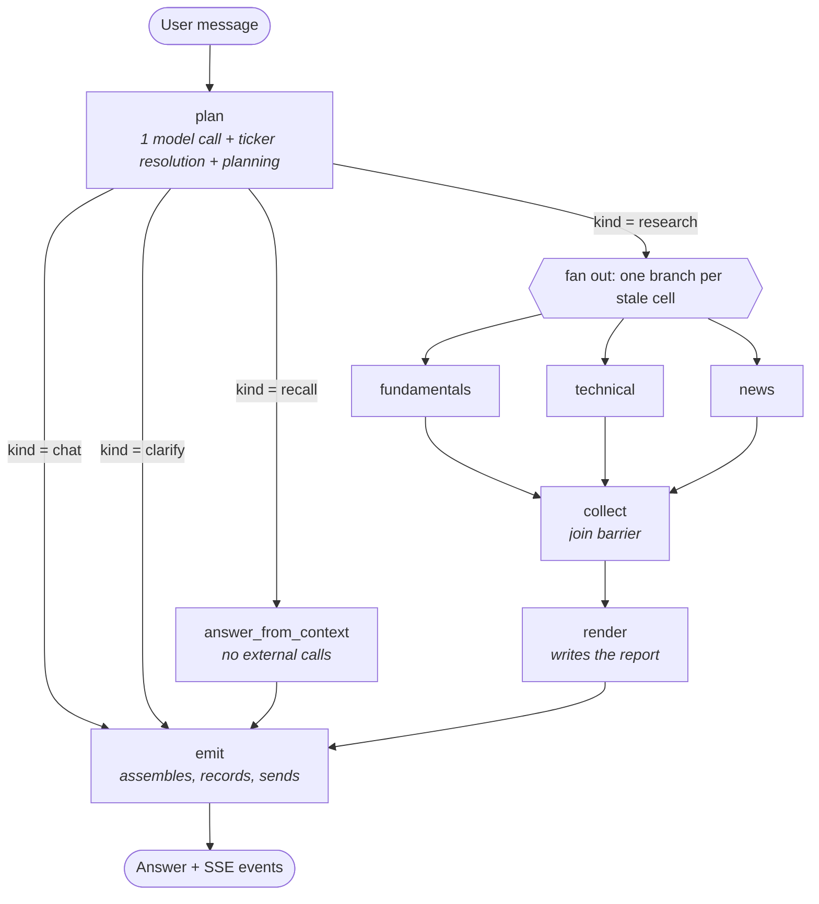
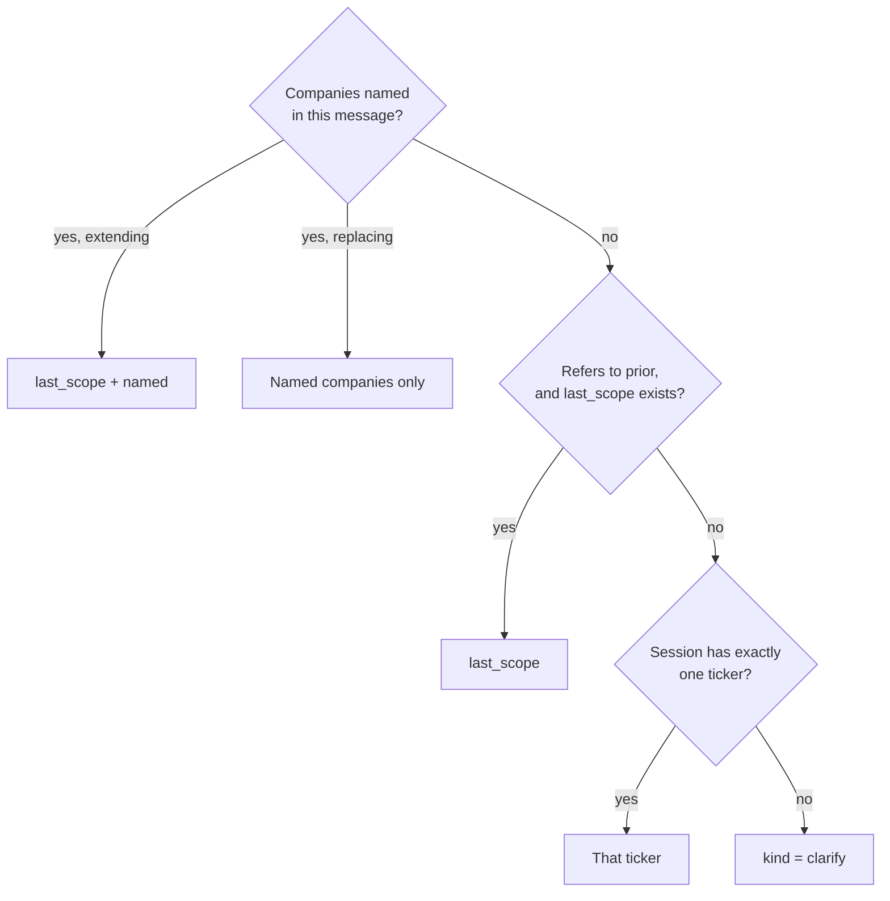

# Architecture — AI Stock Research Assistant

This document explains how the AI Stock Research Assistant works and how its main
components fit together. Sections 1–5 cover the core architecture; the remaining sections
describe the individual components in more detail.

---

## 1. Scope

The system uses three specialist agents to collect company financials, price data, and
recent news. A final synthesis step combines their findings into a single report, with
citations linking each claim back to its source.

While the research is running, progress is streamed to the browser. The session also
remains available for follow-up questions.

**Supported requests**

- Single company: *"Analyse NVIDIA"*
- Comparison: *"Compare NVIDIA and AMD"*
- Portfolio review: *"How is my portfolio of NVDA, AAPL and MSFT doing?"*
- Follow-up questions, including questions that require fresh data: *"Any news on AMD
  today?"*

**Out of scope**

- Finding or ranking stocks across a market or sector. The system analyses companies named
  by the user.
- Personalised financial advice.
- Placing or managing trades.
- Non-US-listed companies, due to the current data provider limitations (§8).

---

## 2. Design principles

**The model extracts observations; code makes decisions.** Each message gets one model
call, which reports what is present in the text: companies named, whether the message
points backwards, which analyses are requested. Scope, shape, freshness and routing are
computed from those observations in ordinary Python. This keeps the entire decision
surface testable without an API key or network access.

**Every message gets a fresh plan.** `TurnPlan` is rebuilt from scratch on each message
and never persists. Nothing from the previous turn's scope, shape or fetch list can carry
into the next one implicitly.

**Failures are values, not exceptions.** Specialist agents return a result marked `ok` or
`failed` with a timestamp. Nothing propagates upward to abort a run.

**One exit point.** `emit` is the only node that sends an answer, and it records the
transcript entry in the same operation.

---

## 3. Request flow

Every message follows the same route regardless of type.



Four turn kinds, one exit.

| Kind | Trigger | External calls |
|---|---|---|
| `chat` | No researchable subject — greeting, acknowledgement, off-domain request, screening request | Classifier only |
| `clarify` | Scope could not be resolved | Classifier only |
| `recall` | Scope resolved, every cell already fresh | Classifier + one synthesis call |
| `research` | Scope resolved, one or more cells stale | Classifier + one call per cell + one synthesis call |

---

## 4. State model

Two separate objects with different lifetimes.

### Session state — persists across messages

```python
class SessionState(TypedDict):
    session_id: str
    user_question: str

    researched:   dict[ticker][agent] -> TickerCell   # accumulated, merged
    conversation: list[ConversationMessage]           # appended

    last_scope: list[str]      # overwritten by emit
    last_shape: Shape          # overwritten by emit

    pending: PendingClarification | None
    turn: TurnPlan             # replaced every message
```

| Field | Lifetime | Purpose |
|---|---|---|
| `researched` | Grows, never reset | Cell store, keyed by ticker then agent |
| `conversation` | Appended | Transcript, written only by `emit` |
| `last_scope` / `last_shape` | Overwritten per answer | Antecedent for backward references |
| `pending` | Until resolved or exhausted | Open clarifying question plus attempt count |

`last_scope` and `last_shape` are consulted only when the current message names no
companies of its own, and are overridden whenever it does.

`pending` carries an attempt counter. After two attempts the system stops asking and
requests a ticker directly, rather than issuing further rephrased questions.

Replies to clarifying questions are not special-cased. A reply is classified like any
other message, with the open question visible in context, so a user who ignores the
question and asks something else is handled by the same path.

### Turn plan — rebuilt every message

```python
class TurnPlan(TypedDict):
    kind:  TurnKind          # research | recall | clarify | chat
    scope: list[str]         # tickers this answer covers
    shape: Shape             # single | comparison | portfolio
    aspects: list[AgentName] # which analyses this turn covers
    fetch: list[CellRef]     # exactly the cells failing the freshness check
    notes: list[str]         # user-facing warnings, e.g. a dropped ticker
    reply: str | None        # prebuilt text for chat and clarify turns
    hedged: bool             # scope came from an ambiguous subject
    off_domain_topic: str | None
    output: TurnOutput | None
```

`scope` is a subset or superset of the session's tickers, never implicitly all of them.
`fetch` is per `(ticker, agent)` cell rather than per ticker, so one stale cell re-runs one
node.

---

## 5. Turn planning

### Step 1 — classify (one model call)

The classifier returns observations only:

| Field | Meaning |
|---|---|
| `companies` | Each company named, with its role (below) |
| `extends_prior_scope` | Does this add to the companies in play rather than replace them? *"add Intel to this comparison"* |
| `refers_to_prior` | Does it ask about something already discussed? *"which one is better?"* |
| `screening_scope` | Does it ask the system to find candidates? *"best Indian stocks"* |
| `shape_hint` | Does the wording request a comparison or portfolio view? |
| `aspects` | Is it restricted to financials, price, or news? |
| `pleasantry` | Is the message purely a greeting or acknowledgement? |
| `off_domain_topic` | Is any part of it outside what the system does? |

Each company carries a role:

- **`research_subject`** — something is asked about the company. *"How is Amazon stock
  doing?"*
- **`incidental`** — the company is context for a different subject. *"Amazon is not doing
  well, I might switch jobs"* is a question about a career.
- **`unclear`** — indeterminate from the message alone. *"How is Amazon doing?"* with no
  prior context.

Financial-sounding vocabulary does not by itself make a message a research request.
*"Doing badly"*, *"falling"* and *"laying people off"* describe a company without asking
anything about it.

### Step 2 — resolve tickers

Company names are resolved to symbols and validated against the price provider. Validation
requires actual price history, not a well-formed string: bare `TCS` matches a delisted US
company, while Tata Consultancy Services is `TCS.NS`. Unresolved companies are dropped and
recorded in `notes`.

### Step 3 — plan (no model call)

**Scope**



A named company replaces the previous scope unless the message signals it is adding to it.
There is no rung that falls back to the whole session.

**Shape**

1. One ticker in scope → `single`. A company cannot be compared with itself, so this is
   checked before the model's hint and is what allows an answer to narrow.
2. Otherwise use `shape_hint` if it specified comparison or portfolio.
3. Otherwise keep `portfolio` if the previous answer was a portfolio view over the same
   set.
4. Otherwise `comparison`.

**Fetch**

Results are stored as **cells**: one cell is one ticker plus one analysis. A cell is
re-fetched when any of the following holds.

| Condition | Meaning |
|---|---|
| missing | Never fetched |
| failed | Previous attempt failed |
| empty | Succeeded but produced no usable findings |
| stale | Older than that data type's validity window |

Failed attempts are timestamped like successful ones. Freshness therefore checks status as
well as age — otherwise a ticker whose three lookups all failed would present three recent
timestamps and never be retried.

| Data | Validity | Rationale |
|---|---|---|
| News | 5 minutes | Continuous publication |
| Price / technical | 15 minutes while the market is open, otherwise until the next open | Daily bars are final once the market closes |
| Company financials | 1 hour | Changes on quarterly filings |

No window may be shorter than the data layer's own 5-minute cache, which is asserted at
import: a shorter TTL would produce refetches that return the cached value and appear to
have worked.

An empty `fetch` list produces `kind = recall`; a non-empty one produces `kind = research`.

---

## 6. Specialist agents

One instance per `(ticker, agent)` cell in `fetch`, dispatched as parallel branches. Agents
have no knowledge of each other or of how many branches exist — `scope` is narrowed to a
single ticker per branch.

| Agent | Source | Output |
|---|---|---|
| `fundamentals` | Finnhub | Sector, margins, growth, valuation multiples, debt, cash |
| `technical` | Twelve Data | SMA 20/50/200, RSI, MACD, 52-week range, momentum, volatility |
| `news` | DuckDuckGo | Recent headlines and sentiment |

Each agent fetches its source, calls the model for a structured summary, and returns a
result. Both the data fetch and the model call are awaited, so branches genuinely overlap;
a blocking call in this path serialises the whole fan-out.

Model calls use a forced-tool-call schema with a bounded retry. Groq occasionally answers a
structured-output prompt in plain text (`tool_use_failed`), which is sampling variance and
succeeds on a retry with the same prompt; a malformed request is not retried.

Each agent produces **findings** — the smallest citable unit:

```python
{ "id": "NVDA-fundamentals-1",
  "claim": "Profit margins are strong",
  "evidence": "Profit margin: 0.31",
  "source": { "label": "NVDA fundamentals (Finnhub)", "url": ..., "as_of": ... } }
```

Every non-obvious statement in a report carries a finding id in brackets, and every cited
id appears in the sources list.

---

## 7. Report generation

### `render`

Takes `scope`, `shape` and `aspects` as arguments and writes the matching report: single,
comparison, or portfolio. It reads no session-level fields, so a narrowing follow-up cannot
re-render companies outside its scope.

A cell counts as **usable** only if it succeeded *and* produced findings — succeeding while
finding nothing is a fact, not evidence. Each shape has a minimum usable count
(`comparison` requires two). Below that threshold the turn returns a plain explanation of
what failed rather than a report shell with a heading and a verdict line behind no data.

Prompts carry two constraints that the code enforces rather than requests: citation ids
must come from the list of findings actually produced, and square brackets are reserved for
those ids. Output style is constrained to plain punctuation.

If the synthesis call fails, the rendered sections are emitted as-is. They are already a
complete cited document; the narrative is lost, the research is not.

### `emit`

The only node that sends an answer, and the only writer to `conversation`. It assembles the
final text in order:

1. Hedge prefix, if `hedged`
2. Scope echo, on short answers — reports state their scope in the heading
3. The answer
4. Coverage line, if anything was unavailable:
   `Coverage: NVDA - technical unavailable (request timed out).`
5. `notes`, on research and recall turns
6. Off-domain acknowledgement, on research and recall turns

The coverage line is generated from cell status, not written by the model, so gap
disclosure does not depend on the model remembering to mention it.

Items 5 and 6 are restricted to turns that produced research. On a `chat` turn the reply
already names the off-domain topic, and there is no research above for the acknowledgement
to refer to.

`emit` also writes `last_scope` and `last_shape`, which is what makes the next backward
reference resolvable.

---

## 8. Data sources

| Provider | Used for |
|---|---|
| Finnhub | Company financials |
| Twelve Data | Daily price history, technical indicators, ticker validation |
| DuckDuckGo | News titles, snippets, links, dates |

Full article text is not retrieved; the evidence unit is the search result.

Both market-data providers run on free plans that effectively cover **US-listed stocks
only**. A valid non-US company is refused with an explicit *"isn't currently supported"*
rather than a message implying a typo.

Shared behaviour:

- Both providers report an invalid ticker with a success response and an empty body.
  Validity is therefore judged on response shape, not status code.
- Retries apply to transient failures only — network errors, rate limits, provider 5xx. A
  non-existent ticker is permanent and is not retried.
- All calls are cached for 5 minutes and bounded by a timeout.

Indicator maths (SMA, RSI, MACD) is implemented in pandas and verified in tests against an
independent implementation over a fixed price series.

---

## 9. Failure handling

| Level | Behaviour |
|---|---|
| Data fetch | Timeout, then retry — transient failures only |
| Agent | Catches its own errors, returns a `failed` cell, never aborts the run |
| Ticker | Unresolvable tickers are dropped with a reason; remaining tickers proceed |
| Message | Off-domain, screening and pleasantry turns never reach the agents |
| Report | Runs once every dispatched agent has settled, succeeded or failed |
| Classifier | A classification failure is reported, not answered around with stale context |

Every failure is surfaced with a reason. Silent gaps and bare error states are not
acceptable outcomes at any level.

---

## 10. Streaming and logging

### Live progress

The API derives events from graph execution and streams them over Server-Sent Events.
Nodes do not publish events themselves, so node code stays free of streaming concerns and
the client does not depend on LangGraph internals.

| Event | Emitted when |
|---|---|
| `run_started` | Run begins |
| `router_completed` | Plan built — carries shape, scope, notes |
| `agent_started` | One per dispatched cell, published up front |
| `agent_completed` | As each agent settles, with status, summary and findings |
| `report_ready` / `followup_answer_ready` | Output produced |
| `run_completed` / `run_failed` | Run ends |

`agent_started` defines the set of cells the turn is running, which is what the client
renders progress from. The turn's `aspects` is not published: it describes what the user
asked about, which differs from what is dispatched whenever a follow-up re-fetches only
stale cells.

Events are persisted to SQLite before being sent. A client reconnecting reports the last
event id it saw and receives everything after it, with no loss and no duplication.

### Log file

`logs/dump.log` records every node, external call with timing, retry and fallback as one
structured line:

```
timestamp | level | session_id | component | message | extra fields as JSON
```

A session's full behaviour is reconstructable with `grep`. The file rotates by size.

---

## 11. Testing

**Unit tests** cover planning in isolation. Scope, shape, freshness and fetch are pure
functions of `(observations, resolution, state, clock)`, so these tests require no API key,
no mocking and no network.

**Graph tests** run the full graph with providers and model stubbed, covering behaviour
that only appears end to end: parallel result merging, partial failure, and dispatching
only the requested cells.

**Eval harness** (`eval/`) runs real questions against the real system and scores them two
ways.

Deterministic checks:

| Check | Blocking | Catches |
|---|---|---|
| Valid structure | Yes | Malformed output |
| Citation integrity | Yes | `[id]` markers that resolve to no real finding |
| Well-formed findings | Yes | Empty claims, missing evidence |
| Total failure stated | Yes | A failed run presented as a report |
| Query type / companies / route | No | Recorded; these are judgment calls |
| Latency | No | Tracked against a budget |

A model judge covers what cannot be checked mechanically: grounding, relevance,
completeness, and whether a comparison is genuinely comparative rather than separate
reports concatenated. The judge runs on Gemini rather than Groq so the harness is not
grading its own output.

---

## 12. Tech stack

**Backend** — Python 3.11+, FastAPI, LangGraph, `langchain-groq`, `requests`, `ddgs`,
`pandas`, `tenacity`, `cachetools`, `pydantic`, SQLite for session state and the event log.
`langchain-google-genai` is used only by the eval judge.

**Frontend** — Vite, React, TypeScript, Tailwind, and the browser's `EventSource` for live
updates.

**Config** — `.env`, not committed. `.env.example` lists the required keys: `GROQ_API_KEY`,
`FINNHUB_API_KEY`, `TWELVEDATA_API_KEY`, plus optional model names, timeouts and
`MAX_TICKERS`.

---

## 13. Known limits

- **Classification errors propagate.** Everything downstream is deterministic, so a message
  attributed to the wrong company is executed correctly against the wrong company. Short
  answers state their scope so the error is visible immediately.
- **A run in progress does not survive a restart.** Persisted state and past answers do.
- **Single process.** Live event delivery is in-memory, so horizontal scaling requires a
  shared message layer first. The persisted event log is unaffected.
- **US-listed stocks only** (§8).
- **News is headlines and snippets**, not article text.
- **Market holidays are not modelled.** The system treats a holiday as an open market, so
  price data refreshes a few extra times.
- **No portfolio mathematics** — no correlations, optimisation or risk ratios.
